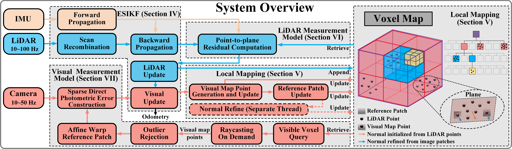

# FAST-LIVO2-AGX (ROS 2 Humble)

> **FAST-LIVO2: Fast, Direct LiDAR-Inertial-Visual Odometry — U-AMC fork**
> Many thanks to HKU MARS Lab and [Chunran Zheng](https://github.com/xuankuzcr) for open-sourcing the original work. 
This is a ROS 2 Humble fork maintained by U-AMC, targeting NVIDIA Jetson AGX Orin and Intel NUC platforms with extended sensor support.

### What this fork adds

- **Livox Mid-360** support alongside the original Avia path
- **LiDAR-Inertial-only / LiDAR-Visual-Inertial** pipeline split (per-LiDAR `_only` and `_lvi` configs and launch files)
- **Rolling-shutter** per-row timing in the VIO patch alignment
- **Online time-delay estimation** between image and IMU
- **Self-contained Docker image** for reproducible builds

<div align="center">
    
</div>

---

## Table of Contents

1. [News](#news)
2. [Introduction](#1-introduction)
3. [Prerequisites](#2-prerequisites)
4. [Build](#3-build)
   - [Native (colcon)](#31-native-colcon)
   - [Docker](#32-docker)
5. [Run the demos](#4-run-the-demos)
6. [License](#5-license)
7. [Contact](#contact)

---

## News

Upstream FAST-LIVO2 milestones (from HKU MARS Lab):

- **2025-01-23** — Code released
- **2024-10-01** — Accepted by IEEE T-RO '24
- **2024-07-02** — Conditionally accepted

## Contact

For inquiries about the original FAST-LIVO2, contact
[zhengcr@connect.hku.hk](mailto:zhengcr@connect.hku.hk).

---

## 1. Introduction

FAST-LIVO2 is an efficient and accurate LiDAR-inertial-visual fusion
localization and mapping system. It targets real-time 3D reconstruction and
onboard robotic localization in severely degraded environments.

**Original developer:** [Chunran Zheng](https://github.com/xuankuzcr)

### 1.1 Video

Accompanying video on [Bilibili](https://www.bilibili.com/video/BV1Ezxge7EEi)
and [YouTube](https://youtu.be/6dF2DzgbtlY).

### 1.2 Papers

- [FAST-LIVO2: Fast, Direct LiDAR-Inertial-Visual Odometry](https://arxiv.org/pdf/2408.14035)
- [FAST-LIVO2 on Resource-Constrained Platforms](https://arxiv.org/pdf/2501.13876)
- [FAST-LIVO: Fast and Tightly-coupled Sparse-Direct LiDAR-Inertial-Visual Odometry](https://arxiv.org/pdf/2203.00893)
- [FAST-Calib: LiDAR-Camera Extrinsic Calibration in One Second](https://www.arxiv.org/pdf/2507.17210)

### 1.3 Hard-synchronized handheld device

CAD files, synchronization scheme, STM32 source, wiring, and sensor ROS
drivers are open-sourced at
[**LIV_handhold**](https://github.com/xuankuzcr/LIV_handhold).

### 1.4 Companion dataset

The evaluation dataset
[**FAST-LIVO2-Dataset**](https://connecthkuhk-my.sharepoint.com/:f:/g/personal/zhengcr_connect_hku_hk/ErdFNQtjMxZOorYKDTtK4ugBkogXfq1OfDm90GECouuIQA?e=KngY9Z)
is available online.

### 1.5 LiDAR–camera calibration

The [**FAST-Calib**](https://github.com/hku-mars/FAST-Calib) toolkit is
recommended. Its output extrinsic parameters drop directly into the YAML
config.

### 1.6 Related dataset

[**MARS-LVIG dataset**](https://mars.hku.hk/dataset.html) — a multi-sensor
aerial-robot SLAM dataset for LiDAR–visual–inertial–GNSS fusion.

---

## 2. Prerequisites

| Dependency  | Version  | Install                                                        |
|-------------|----------|----------------------------------------------------------------|
| Ubuntu      | 22.04    | —                                                              |
| ROS         | Humble   | [ROS 2 Humble installation](https://docs.ros.org/en/humble/Installation.html) |
| PCL         | ≥ 1.8    | [pointclouds.org](https://pointclouds.org/)                    |
| Eigen       | ≥ 3.3.4  | [eigen.tuxfamily.org](https://eigen.tuxfamily.org)             |
| OpenCV      | ≥ 4.2    | [opencv.org](http://opencv.org/)                               |
| Sophus      | latest   | see §2.1                                                        |
| Vikit (rpg) | fork     | see §2.2                                                        |
| livox_ros_driver2 | latest | [Livox-SDK/livox_ros_driver2](https://github.com/Livox-SDK/livox_ros_driver2) |

### 2.1 Sophus

**From apt (recommended):**

```bash
sudo apt install ros-$ROS_DISTRO-sophus
```

**From source:**

```bash
git clone https://github.com/strasdat/Sophus.git
cd Sophus
git checkout a621ff
mkdir build && cd build && cmake ..
make
sudo make install
```

If the build fails with `so2.cpp:32:26: error: lvalue required as left operand of assignment`, apply this patch:

```diff
 namespace Sophus
 {

 SO2::SO2()
 {
-  unit_complex_.real() = 1.;
-  unit_complex_.imag() = 0.;
+  unit_complex_.real(1.);
+  unit_complex_.imag(0.);
 }
```

### 2.2 Vikit

Vikit provides camera models, math helpers, and interpolation utilities.

ROS 2 has no direct global parameter server analogous to ROS 1, so the fork
used here implements a workaround for fetching camera parameters; see this
[discourse thread](https://discourse.ros.org/t/ros2-global-parameter-server-status/10114/11)
for background. The fork additionally extends the camera model set with a
rational-polynomial distortion model.

```bash
cd ~/fast_ws/src
git clone https://github.com/U-AMC/rpg_vikit_rational_polynomial.git rpg_vikit
```

Reference implementations:

- [uzh-rpg/rpg_vikit](https://github.com/uzh-rpg/rpg_vikit)
- [xuankuzcr/rpg_vikit](https://github.com/xuankuzcr/rpg_vikit)
- [Robotic-Developer-Road/rpg_vikit](https://github.com/Robotic-Developer-Road/rpg_vikit)

### 2.3 livox_ros_driver2

Follow the upstream
[installation instructions](https://github.com/Livox-SDK/livox_ros_driver2).

> Why not `livox_ros_driver` (v1)? It is not directly compatible with ROS 2.
> The v2 `CustomMsg` is functionally equivalent and ships a working ROS 2
> build, so it's the right choice here.

---

## 3. Build

### 3.1 Native (colcon)

```bash
cd ~/fast_ws/src
git clone https://github.com/U-AMC/FAST-LIVO2-AGX.git fast_livo
cd ..
colcon build --symlink-install --continue-on-error
source ~/fast_ws/install/setup.bash
```

### 3.2 Docker

A self-contained ROS 2 Humble image is provided. Quickstart:

```bash
docker build -t fast-livo2:humble .
docker run --rm -it --net=host fast-livo2:humble
```

The image is fully pre-built — `ros2 launch fast_livo ...` works
immediately inside the container, no `colcon build` needed.

See [**docs/docker.md**](docs/docker.md) for image contents, build options,
and step-by-step run instructions with a ROS 2 bag (including X11 forwarding
for RViz and how to persist `Log/` outputs).

---

## 4. Run the demos

Download a rosbag from the
[FAST-LIVO2-Dataset](https://connecthkuhk-my.sharepoint.com/:f:/g/personal/zhengcr_connect_hku_hk/ErdFNQtjMxZOorYKDTtK4ugBkogXfq1OfDm90GECouuIQA?e=KngY9Z).

### 4.1 Convert a ROS 1 bag to ROS 2

```bash
pip install rosbags
rosbags-convert --src Retail_Street.bag --dst Retail_Street
```

References: [gitlab.com/ternaris/rosbags](https://gitlab.com/ternaris/rosbags),
[pypi rosbags](https://pypi.org/project/rosbags/).

### 4.2 Patch the CustomMsg type

Because this repo uses `livox_ros_driver2`'s `CustomMsg`, edit the bag's
`metadata.yaml` to point at the v2 type:

```diff
     topic_metadata:
       name: /livox/lidar
       offered_qos_profiles: ''
       serialization_format: cdr
-      type: livox_ros_driver/msg/CustomMsg
+      type: livox_ros_driver2/msg/CustomMsg
       type_description_hash: RIHS01_94041b4794f52c1d81def2989107fc898a62dacb7a39d5dbe80d4b55e538bf6d
```

### 4.3 Pick a pipeline

Two pipelines are provided per LiDAR: **LiDAR-Inertial only** (LiDAR + IMU)
and **LiDAR-Visual-Inertial** (LiDAR + IMU + camera). They share the same
launch wiring; the only difference is `img_en` in the YAML (`0` vs `1`).

| LiDAR        | LiDAR-Inertial only            | LiDAR-Visual-Inertial               |
|--------------|--------------------------------|-------------------------------------|
| Livox Avia   | `mapping_aviz.launch.py` → `config/avia_only.yaml`   | `mapping_aviz_lvi.launch.py` → `config/avia_lvi.yaml`     |
| Livox Mid-360| `mapping_mid360.launch.py` → `config/mid360_only.yaml` | `mapping_mid360_lvi.launch.py` → `config/mid360_lvi.yaml` |

Use the LiDAR-only variant when no camera is connected or the camera topic
is unreliable; use the LVI variant for full photometric refinement.

### 4.4 Run

Source the workspace first.

```bash
# LiDAR-Inertial only (Avia)
ros2 launch fast_livo mapping_aviz.launch.py use_rviz:=True

# LiDAR-Visual-Inertial (Avia)
ros2 launch fast_livo mapping_aviz_lvi.launch.py use_rviz:=True

# LiDAR-Inertial only (Mid-360)
ros2 launch fast_livo mapping_mid360.launch.py use_rviz:=True

# LiDAR-Visual-Inertial (Mid-360)
ros2 launch fast_livo mapping_mid360_lvi.launch.py use_rviz:=True
```

Then play a bag in another terminal:

```bash
ros2 bag play -p Retail_Street   # space toggles play/pause
```

---

## 5. License

This package is released under the
[**GPLv2**](http://www.gnu.org/licenses/) license.
